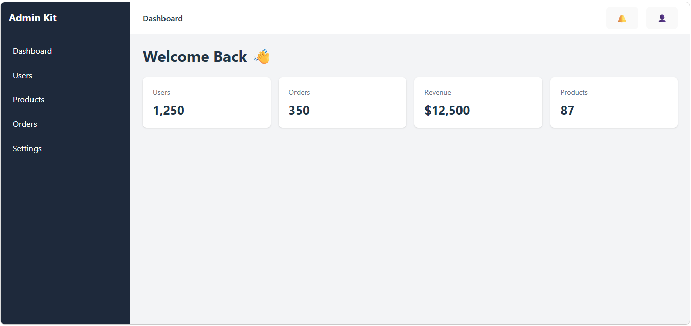
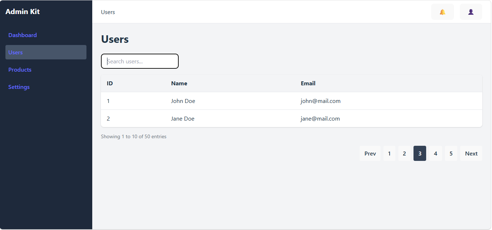
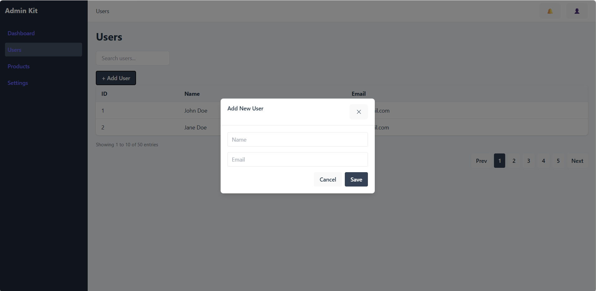

# React Admin UI Kit

Modern Admin Dashboard UI built with React, Vite, and Tailwind CSS.

## 📊 Project Status

**Version:** v0.1.0

**Status:** Active Development 🚀

---

## 🚀 Tech Stack

* React 18
* Vite 6
* JavaScript + SWC
* Tailwind CSS 3
* React Router DOM

---

## 📁 Project Structure

```text
src
├── assets
├── components
│   ├── Navbar.jsx
│   ├── Sidebar.jsx
│   ├── StatCard.jsx
│   ├── DataTable.jsx
│   ├── Pagination.jsx
│   └── Modal.jsx
├── hooks
├── layouts
│   └── AdminLayout.jsx
├── pages
│   ├── Dashboard.jsx
│   ├── Users.jsx
│   ├── Products.jsx
│   └── Settings.jsx
├── routes
│   └── AppRoutes.jsx
├── services
├── styles
├── utils
├── App.jsx
└── main.jsx
```

---

## ✨ Current Features

### Dashboard

* Dashboard Layout
* Statistics Cards
* Responsive Content Area

### Navigation

* Sidebar Navigation
* Top Navbar
* Multi Page Navigation
* Active Sidebar Menu
* Dynamic Navbar Title

### Data Management

* Reusable DataTable Component
* Search Input UI
* Empty State Handling
* Reusable Pagination Component

### UI Components

* Reusable Modal Component
* Overlay Close Support
* ESC Key Close Support

### Architecture

* Reusable Layout Structure
* Component-Based Design
* Route Management with React Router

---

## 📸 Screenshots

### Dashboard Layout



### Users Table



### Add User Modal



> Screenshots will be updated as development progresses.

---

## 💡 Why This Project?

This project is built to provide a reusable and scalable admin dashboard starter kit using modern React tooling.

The goal is to create a solid foundation for:

* ERP Systems
* Inventory Management Systems
* CRM Applications
* Financial Dashboards
* Internal Business Applications
* Administrative Panels

---

## 🚧 Roadmap

### Phase 1 - Dashboard Foundation

* [x] Project Initialization
* [x] Vite 6 Setup
* [x] Tailwind CSS Setup
* [x] React Router Setup
* [x] Folder Structure Setup
* [x] Dashboard Layout
* [x] Sidebar Component
* [x] Navbar Component
* [x] Statistics Cards

### Phase 2 - Navigation

* [x] Users Page
* [x] Products Page
* [x] Settings Page
* [x] Active Sidebar Menu
* [x] Dynamic Navbar Title
* [ ] Breadcrumb Navigation

### Phase 3 - Data Management

* [x] Data Table Component
* [x] Search Component
* [x] Pagination Component
* [x] Empty State Component
* [ ] Filter Component
* [ ] Sortable Columns
* [ ] Server Side Pagination

### Phase 4 - UI Components

* [x] Modal Component
* [ ] Drawer Component
* [ ] Toast Notification
* [ ] Confirm Dialog
* [ ] Loading Skeleton
* [ ] Badge Component
* [ ] Dropdown Component

### Phase 5 - Authentication

* [ ] Login Page
* [ ] Register Page
* [ ] Protected Routes
* [ ] Authentication Layout
* [ ] Session Management

### Phase 6 - User Experience

* [ ] Dark Mode
* [ ] Theme Switcher
* [ ] Mobile Responsive Sidebar
* [ ] Responsive Tables
* [ ] Accessibility Improvements

### Phase 7 - Advanced Components

* [ ] Form Builder
* [ ] Form Validation
* [ ] Date Picker
* [ ] File Upload Component
* [ ] Dashboard Charts
* [ ] Statistics Widgets

### Phase 8 - Production Ready

* [ ] Code Splitting
* [ ] Lazy Loading
* [ ] Error Boundary
* [ ] Environment Configuration
* [ ] Deployment Guide
* [ ] Complete Documentation

---

## 🗺️ Upcoming Releases

### v0.2.0

* Toast Notification
* Confirm Dialog
* Loading Skeleton

### v0.3.0

* Dark Mode
* Theme Switcher
* Responsive Sidebar

### v0.4.0

* Authentication Pages
* Protected Routes
* Login Layout

### v1.0.0

* Production Ready Admin UI Kit
* Reusable Components Library
* Complete Documentation
* Public Release

---

## 🛠 Installation

Clone repository

```bash
git clone https://github.com/knightmaster11/react-admin-ui-kit.git
```

Go to project directory

```bash
cd react-admin-ui-kit
```

Install dependencies

```bash
npm install
```

Run development server

```bash
npm run dev
```

Open browser

```text
http://localhost:5173
```

---

## 📌 Development Progress

### Day 1

* Project Initialization
* Vite 6 Setup
* Tailwind CSS Setup
* React Router Setup
* Folder Structure Setup
* README Documentation

### Day 2

* Dashboard Layout
* Sidebar Navigation
* Navbar Component
* Statistics Card Component
* Responsive Layout Structure

### Day 3

* Multi Page Navigation
* Users Page
* Products Page
* Settings Page
* Active Sidebar Menu
* Dynamic Navbar Title

### Day 4

* Reusable DataTable Component
* Users Table Page
* Search Input UI
* Empty State Handling

### Day 5

* Reusable Pagination Component
* Table Information Section
* Users Table Enhancement
* Pagination Integration

### Day 6

* Reusable Modal Component
* Add User Modal
* Overlay Close Support
* ESC Key Close Support

---

## 🎯 Project Goal

Create a modern, reusable, and scalable Admin Dashboard Starter Kit using:

* React
* Vite
* Tailwind CSS

Focused on real-world business applications such as:

* ERP
* Inventory
* CRM
* Finance
* Internal Enterprise Systems

---

## 🤝 Contributing

Contributions, issues, and feature requests are welcome.

Feel free to fork the repository and submit a pull request.

---

## 📄 License

MIT License
