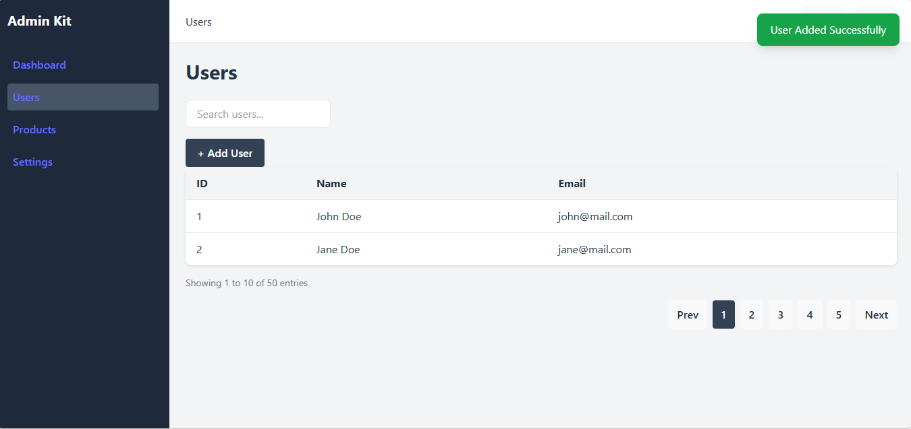

## 📁 Project Structure

```text
src
├── assets
├── components
│   ├── Navbar.jsx
│   ├── Sidebar.jsx
│   ├── StatCard.jsx
│   ├── DataTable.jsx
│   ├── Pagination.jsx
│   ├── Modal.jsx
│   └── Toast.jsx
├── hooks
├── layouts
│   └── AdminLayout.jsx
├── pages
│   ├── Dashboard.jsx
│   ├── Users.jsx
│   ├── Products.jsx
│   └── Settings.jsx
├── routes
│   └── AppRoutes.jsx
├── services
├── styles
├── utils
├── App.jsx
└── main.jsx
```

---

## ✨ Current Features

### Dashboard

* Dashboard Layout
* Statistics Cards
* Responsive Content Area

### Navigation

* Sidebar Navigation
* Top Navbar
* Multi Page Navigation
* Active Sidebar Menu
* Dynamic Navbar Title

### Data Management

* Reusable DataTable Component
* Search Input UI
* Empty State Handling
* Reusable Pagination Component

### UI Components

* Reusable Modal Component
* Reusable Toast Notification
* Overlay Close Support
* ESC Key Close Support
* Auto Close Toast Support
* Multiple Toast Variants

  * Success
  * Error
  * Warning
  * Info

### Architecture

* Reusable Layout Structure
* Component-Based Design
* Route Management with React Router

---

## 📸 Screenshots

### Dashboard Layout


### Users Table


### Add User Modal


### Toast Notification



> Screenshots will be updated as development progresses.

---

## 🚧 Roadmap

### Phase 4 - UI Components

* [x] Modal Component
* [x] Toast Notification
* [ ] Drawer Component
* [ ] Confirm Dialog
* [ ] Loading Skeleton
* [ ] Badge Component
* [ ] Dropdown Component

---

## 🗺️ Upcoming Releases

### v0.2.0

* Confirm Dialog
* Loading Skeleton
* Badge Component

### v0.3.0

* Dark Mode
* Theme Switcher
* Responsive Sidebar

### v0.4.0

* Authentication Pages
* Protected Routes
* Login Layout

### v1.0.0

* Production Ready Admin UI Kit
* Reusable Components Library
* Complete Documentation
* Public Release

---

## 📌 Development Progress

### Day 7

* Reusable Toast Component
* Success Notification
* Auto Close Support
* Multiple Toast Variants

```
Success
Error
Warning
Info
```
